<p align="center">
  
</p>

<h1 align="center">AIO Arr</h1>

<p align="center">
  <b>One login. One page. Your whole media stack.</b><br/>
  Search, download, watch, listen and read - Radarr, Sonarr, Lidarr, Prowlarr, Jellyfin, Plex, Emby, Navidrome, Audiobookshelf, Komga, Kavita and your download clients, all from a single web app.
</p>

<p align="center">
  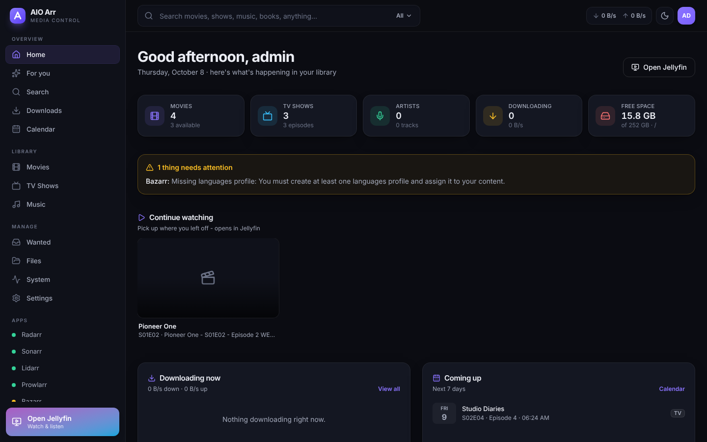
</p>

---

## Why

Running an *arr stack means a dozen browser tabs and a dozen logins. AIO Arr sits on top of the apps you already have and gives you **one** place to:

- 🔎 **Search everything at once** - movies (Radarr), TV (Sonarr), music (Lidarr), books (Readarr) **and every indexer** (Prowlarr). Pick the **categories** to search in - movies, shows, music, audiobooks, books, comics, games, apps… - and every result comes **with a picture**, also the ones straight from your indexers.
- ⬇️ **Download with one click** - sensible defaults (quality profile, root folder, monitoring) are picked for you; advanced options and a manual release picker are one click away.
- ▶️ **Watch, listen or read with one click** - in Jellyfin, Plex or Emby, Navidrome, Audiobookshelf, Komga or Kavita. You choose which app opens what under *Settings → Open with*.
- 🎧 **Downloads land in the right app** - music, audiobooks, books and comics grabbed from your indexers are put into their library folders and the app is told to rescan. A *Listen* / *Read* button appears when it's ready.
- 💾 **Everything else downloads to your PC** - apps, games and other files show up under *Downloads* and *Files* with a download link (folders are zipped on the fly, downloads can be resumed).
- ✨ **Recommendations for you** - picked from what you watch (Jellyfin / Emby history and favourites) and what you download, using a free TMDB key or your Jellyseerr / Overseerr. One click to add them.
- ⬆️ **Update your apps with one click** - see which of your containers have a new version and update them (or all of them, AIO Arr included) from *Settings → Updates*. Optional.
- 🔐 **One login** - AIO Arr talks to every service with its API key; you only sign in once (local accounts, your Jellyfin account, or your SSO).

<table>
  <tr>
    <td>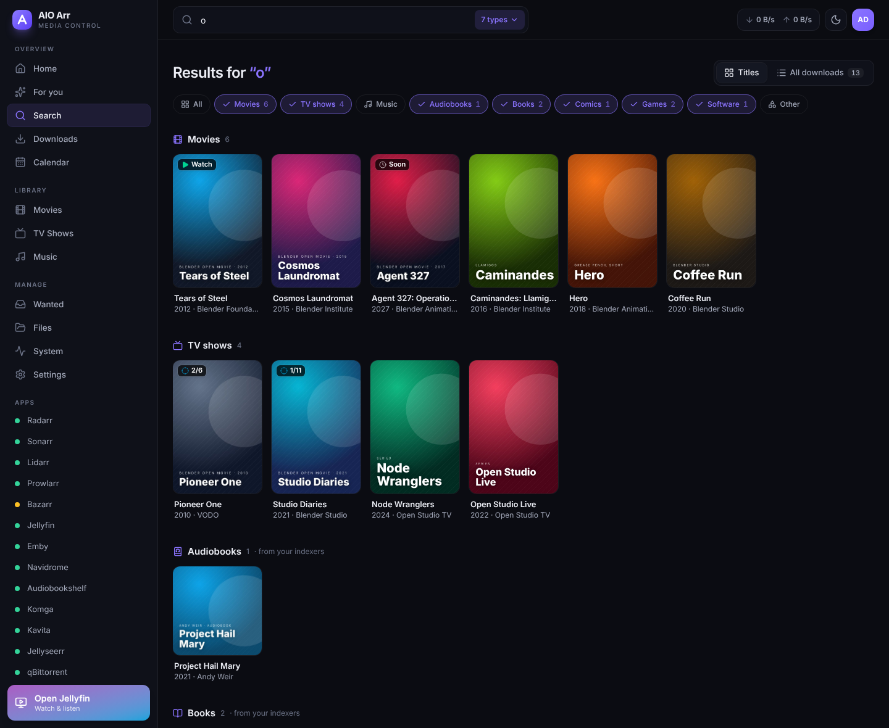</td>
    <td>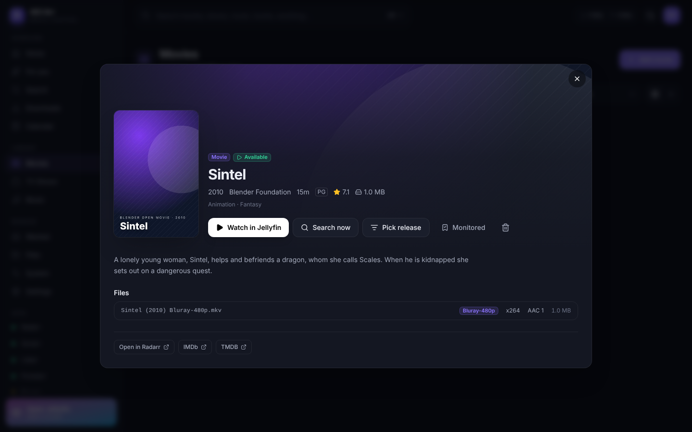</td>
  </tr>
  <tr>
    <td>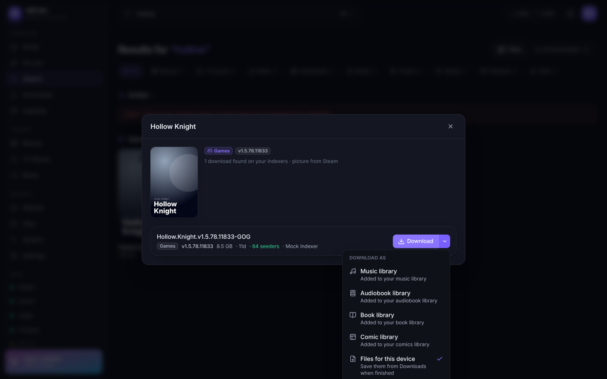</td>
    <td>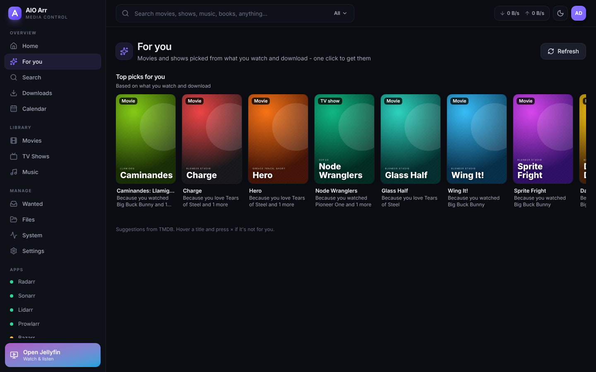</td>
  </tr>
  <tr>
    <td>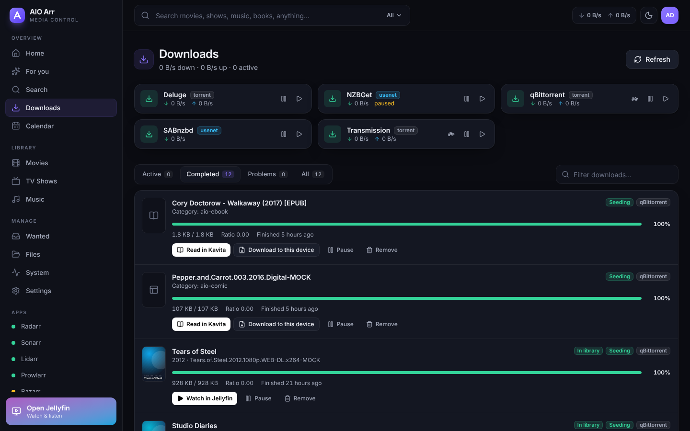</td>
    <td>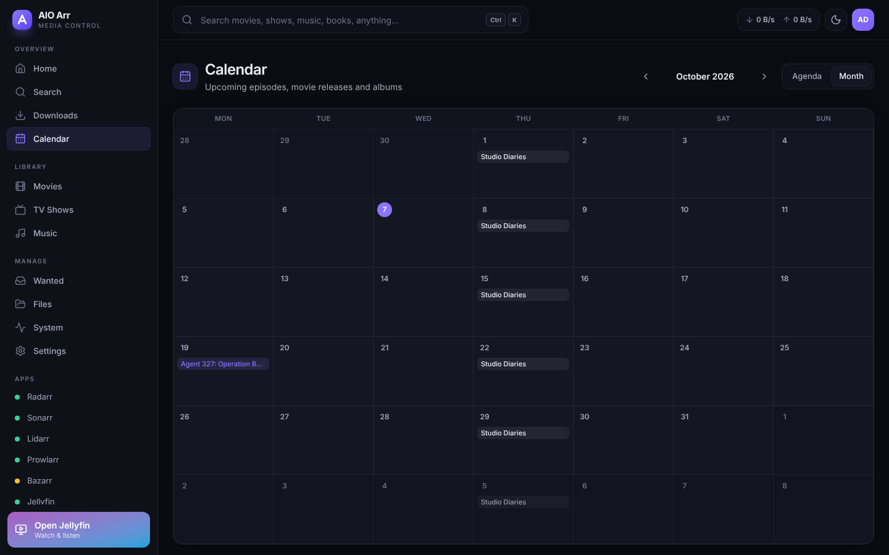</td>
  </tr>
</table>

### Everything on one page

| | |
|---|---|
| **Home dashboard** | Continue watching & recently added (Jellyfin), active downloads with live speeds, what's airing this week, recommendations, service health and disk space |
| **Unified search** (`Ctrl/⌘ K`) | Choose what to search in (the menu in the search box, or the chips on the results page). Movies, shows, artists, albums and books from your *arr apps; games, comics, books, audiobooks, apps… from your indexers, grouped by title with cover art, or every download as a list |
| **For you** | Recommendations based on your watch history, favourites and recent downloads ("Because you watched…"), one click to add, *Not interested* to hide |
| **Libraries** | Movies, TV, music and books with filters (available / wanted / downloading / unmonitored), sorting, grid & list views |
| **Details** | Seasons & episodes (search or pick a release per season / episode, monitor toggles), albums, files & quality, links to IMDb/TMDB and the *arr app |
| **Downloads** | qBittorrent, Transmission, Deluge, SABnzbd and NZBGet in one list - each item shows what movie/episode it is, import problems reported by the *arr apps, pause/resume/remove, *blocklist & find another*, turtle (alt-speed) mode, and *Watch* once imported |
| **Calendar** | Agenda and month views of upcoming episodes, movie releases and albums |
| **Wanted** | Missing episodes / movies / albums with one-click search or *search all* |
| **Files** | Browse completed downloads, download files or whole folders (ZIP) to this device, move a folder into your music / audiobook library |
| **System** | Health of every service, disk space, indexer status, recent activity, and one-click maintenance (RSS sync, search all missing, Jellyfin rescan, indexer sync) |
| **Settings** | Auto-detect services and API keys, test each connection, choose defaults, pick which app opens movies / shows / music / audiobooks / books / comics, update your apps, manage users |

Also: responsive (works great on a phone, installable as a home-screen app), dark & light themes, multiple users with *admin* / *user* roles.

<p align="center">
  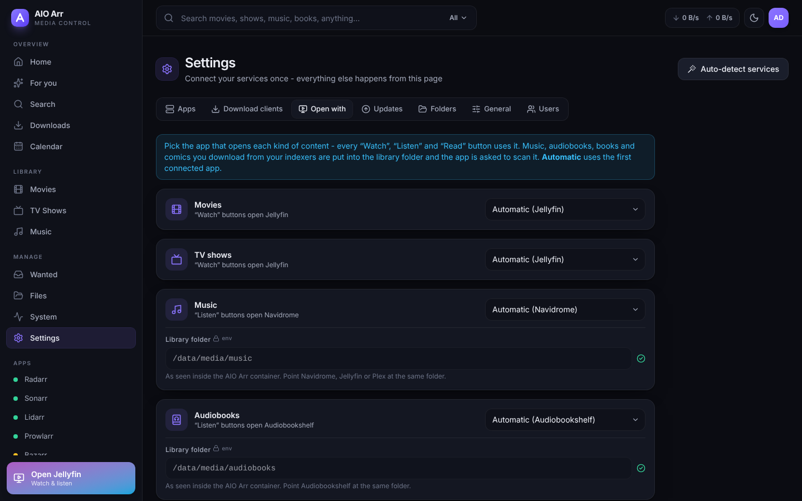
  &nbsp;
  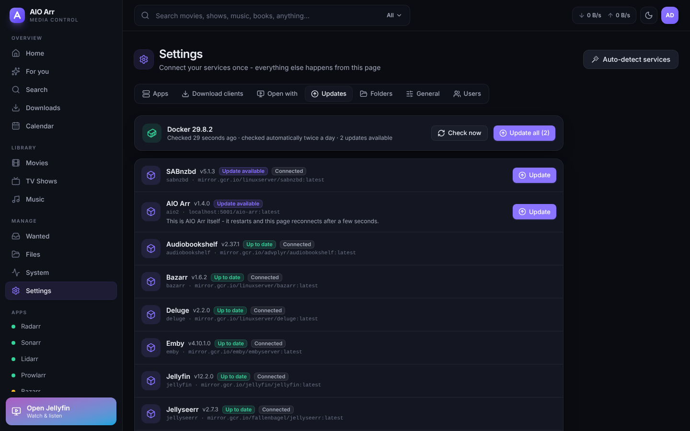
</p>
<p align="center">
  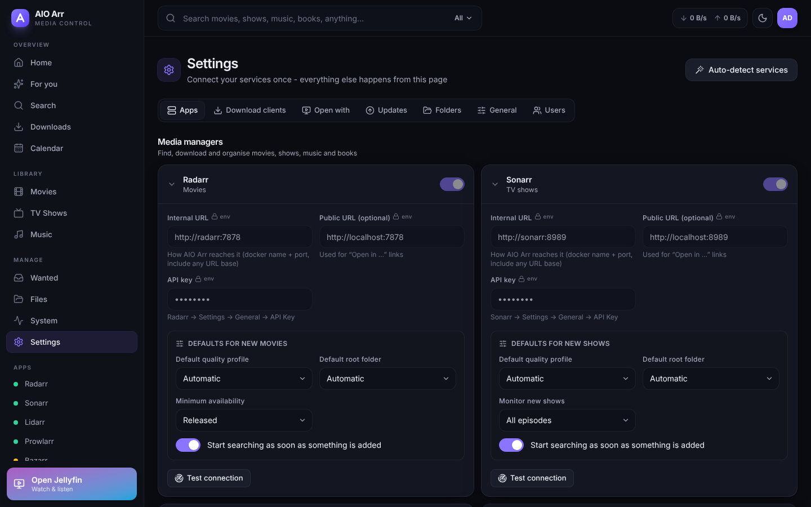
  &nbsp;
  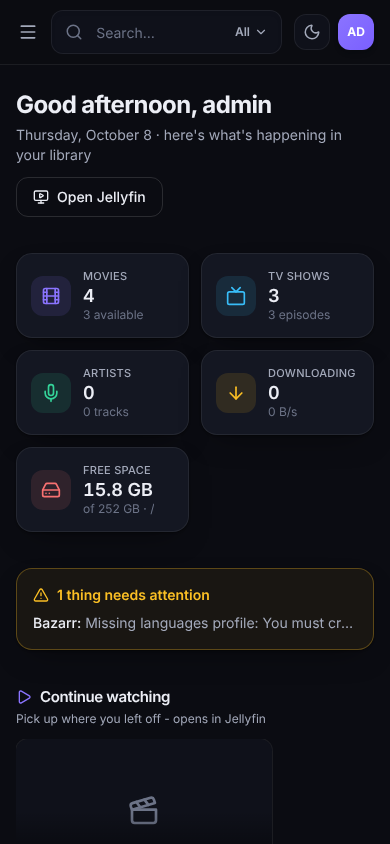
</p>

---

## Install (5 minutes)

You need a Linux machine (or NAS) with **Docker** and the **Docker Compose plugin**, where your *arr apps already run in Docker.

### Option A - the installer (recommended)

```bash
git clone https://github.com/peseotni/aio-arr.git
cd aio-arr
./install.sh
```

The installer:

1. finds your running Radarr, Sonarr, Lidarr, Readarr, Prowlarr, Bazarr, Jellyfin, Plex, Emby, Navidrome, Audiobookshelf, Komga, Kavita, Jellyseerr / Overseerr, qBittorrent, Transmission, Deluge, SABnzbd and NZBGet containers,
2. reads their **API keys** automatically (and Plex's token) and works out the right internal addresses (including qBittorrent behind gluetun),
3. mounts the **same data folders** your apps use, so every path matches, and asks for your music / audiobook / book / comics library folders,
4. can create a **Jellyfin API key** for you (asks for a Jellyfin admin login once) and asks for an optional free **TMDB key** for recommendations,
5. asks whether you want **one-click updates** (that needs access to Docker - see [Updating your apps](#updating-your-apps-with-one-click)),
6. asks for your **subdomain** and sets up HTTPS (built-in Caddy) or hooks into your existing Traefik / Nginx Proxy Manager / SWAG,
7. creates your admin login and starts AIO Arr.

Run it again any time to re-detect. `AIO_YES=1 ./install.sh` accepts all defaults without questions.

### Option B - docker compose by hand

```bash
git clone https://github.com/peseotni/aio-arr.git && cd aio-arr
cp .env.example .env      # set ADMIN_PASSWORD, ARR_NETWORK, DATA_DIR and your API keys
docker compose up -d
```

Then open `http://<server-ip>:8080`. Anything you leave out of `.env` can be filled in later under **Settings** (there is an *Auto-detect services* button).

The two things that matter:

- **`ARR_NETWORK`** - the Docker network your apps are on (`docker network ls`; for a compose stack it's usually `<folder>_default`). AIO Arr reaches them by container name, e.g. `http://radarr:7878`.
- **Volumes** - mount your downloads/media the **same way** your *arr apps and download client do. With the common single-folder layout ([TRaSH guides](https://trash-guides.info/File-and-Folder-Structure/)) that is just `DATA_DIR=/your/data` → `/data`. If your apps use different paths (e.g. `/downloads`, `/movies`) add the same mounts, or set `PATH_MAPPINGS`.

> No image on GHCR yet / prefer to build yourself? `docker compose build` builds it from source.

### Updating

```bash
cd aio-arr
git pull && docker compose up -d --build        # built from source (the installer's fallback)
docker compose pull && docker compose up -d     # using the published image
```

The installer prints the right one for your setup when it finishes. Settings, users and keys live in `./config` and `.env`, so they survive updates. With one-click updates enabled you can also update AIO Arr itself from *Settings → Updates*.

---

## Put it on a subdomain

AIO Arr is a normal web app on port **8080**. Pick whatever matches your setup - in all cases AIO Arr and the proxy must share a Docker network (or point the proxy at `http://<server-ip>:8080`).

<details open>
<summary><b>Built-in Caddy (automatic HTTPS)</b> - easiest if you don't run a reverse proxy yet</summary>

1. Create a DNS record `arr.example.com` → your public IP, forward ports **80** and **443** to the server.
2. In `.env`:
   ```env
   AIO_DOMAIN=arr.example.com
   COMPOSE_FILE=docker-compose.yml:deploy/caddy/docker-compose.caddy.yml
   ```
3. `docker compose up -d` - Caddy gets a Let's Encrypt certificate on the first visit.
</details>

<details>
<summary><b>Traefik</b></summary>

```env
AIO_DOMAIN=arr.example.com
TRAEFIK_NETWORK=proxy          # network your Traefik container is on
TRAEFIK_ENTRYPOINT=websecure
TRAEFIK_CERTRESOLVER=letsencrypt
COMPOSE_FILE=docker-compose.yml:deploy/traefik/docker-compose.traefik.yml
```
</details>

<details>
<summary><b>Nginx Proxy Manager</b></summary>

*Hosts → Proxy Hosts → Add*: domain `arr.example.com`, scheme `http`, forward host `aio-arr`, port `8080` (NPM must be on the same Docker network as AIO Arr - otherwise use the server IP). On the SSL tab request a Let's Encrypt certificate and enable *Force SSL*. Under *Advanced* add `proxy_read_timeout 300s;` so long release searches don't time out.
</details>

<details>
<summary><b>SWAG (linuxserver)</b></summary>

Copy [`deploy/swag/aio-arr.subdomain.conf`](deploy/swag/aio-arr.subdomain.conf) to SWAG's `/config/nginx/proxy-confs/`, add `arr` to SWAG's `SUBDOMAINS`, restart SWAG.
</details>

<details>
<summary><b>Plain nginx / existing Caddy</b></summary>

See [`deploy/nginx/aio-arr.conf`](deploy/nginx/aio-arr.conf) and [`deploy/caddy/Caddyfile`](deploy/caddy/Caddyfile).
</details>

<details>
<summary><b>Cloudflare Tunnel</b> (no port forwarding)</summary>

In Zero Trust → Networks → Tunnels → your tunnel → *Public hostname*: `arr.example.com` → service `http://aio-arr:8080` (cloudflared on the same Docker network). Note Cloudflare stops requests after 100 s, so very slow indexer searches may need a retry.
</details>

**Make "Watch in Jellyfin" open the right address:** set Jellyfin's *public URL* (Settings → Apps → Jellyfin, or `JELLYFIN_PUBLIC_URL`) to the address you use in the browser, e.g. `https://jellyfin.example.com`. The same applies to Navidrome / Audiobookshelf for the *Listen* buttons.

---

## How downloads end up in the right place

| You grab… | What happens | Where you find it |
|---|---|---|
| A **movie / show / album / book** from search | Added to Radarr / Sonarr / Lidarr / Readarr with your defaults and searched immediately | Imported into your library → **Watch / Listen** buttons appear (AIO Arr tells the player about new imports right away) |
| **Music** from the indexer search | Sent to your torrent/usenet client as `aio-music`; when done it is **hard-linked** (torrents keep seeding, no extra space) or moved into your music folder; the music app rescans | **Listen in Navidrome / Jellyfin / Plex / Emby** |
| An **audiobook** from the indexer search | Same, into your audiobook folder as `Author/Title`; Audiobookshelf (or your player) rescans | **Listen in Audiobookshelf** |
| A **book** (EPUB, PDF, …) | Same, into your book folder as `Author/Title`; Kavita / Komga / Audiobookshelf rescan | **Read in Kavita / Komga** |
| A **comic** (CBZ, CBR, …) | Same, into your comics folder as `Series/`; Komga / Kavita rescan | **Read in Komga / Kavita** |
| **Anything else** (apps, games, …) | Sent to your client as `aio-files` | **Downloads** / **Files** → *Download to this device* (folders as ZIP) |

Which app opens what - and whether music, audiobooks, books or comics go into a library at all or stay files to download - is set under **Settings → Open with**. You can also override it per download (*Download as…*), or move a finished download into a library later from **Downloads** or **Files**.

### Search categories and pictures

The search box has a *Search in* menu (and the results page has chips): pick one category, a few, or everything - your choice is remembered. Categories with an *arr app (movies, shows, music, books with Readarr) show that app's results; everything else comes from your indexers, grouped by title (*Hades II* on three indexers is one card with three versions), with cover art from Radarr / Sonarr / Lidarr first and then public sources: TMDB (with a key), Apple, Open Library, Google Books, Steam and Wikipedia. Only the cleaned-up title is sent to those sites; turn them off with `ONLINE_ARTWORK=false` or under *Settings → General*. *All downloads* lists every single release with sorting.

### Recommendations

*For you* (and two rows on the home page) suggests movies and shows based on what you watched and marked as favourite in Jellyfin / Emby and what you recently downloaded with Radarr / Sonarr - titles suggested by several of them rank higher, each with the reason ("Because you watched Dune"). It needs **one** of: a free [TMDB API key](https://www.themoviedb.org/settings/api) (`TMDB_API_KEY`) or a connected **Jellyseerr / Overseerr**; without them Radarr's own list is shown. *Not interested* hides a title for good.

---

## Updating your apps with one click

*Settings → Updates* lists your containers, checks twice a day whether their image has a newer version (it compares the image you run with the registry - pinned versions like `radarr:5.2` stay on that version) and updates one or all of them with a click. An update works like Watchtower: pull the new image, then recreate the container with exactly the same settings, environment, volumes, networks, aliases and fixed IPs. Containers that share its network (`network_mode: service:gluetun`) are reconnected, Docker Compose still recognises the new container, and AIO Arr can update itself (a short-lived helper container does the swap). If the new version doesn't start, the old container is put back.

This needs access to Docker, which is **off by default**. To turn it on, add the socket to the `aio-arr` service (the installer asks for you):

```yaml
    volumes:
      - /var/run/docker.sock:/var/run/docker.sock
```

> ⚠️ Access to the Docker socket gives AIO Arr full control over every container on the machine - as powerful as root. Only admins can see and use updates, but keep AIO Arr behind its login with strong passwords, and leave this off if you don't need it. You can also point `DOCKER_HOST=tcp://socket-proxy:2375` at a Docker socket proxy instead.

Images you built yourself and private registries can't be checked - update those with `docker compose pull` / `--build` as usual.

---

## Configuration reference

Everything can be set in the web UI. Environment variables are handy for automation:

| Variable | Description |
|---|---|
| `ADMIN_USERNAME`, `ADMIN_PASSWORD` | Creates/updates this admin account on start (also the way to reset a forgotten password) |
| `AUTH_MODE` | `local` (default), `proxy` (trust `Remote-User` from Authelia/Authentik; see `AUTH_PROXY_HEADER`, `AUTH_PROXY_ADMINS`) or `none` (no login - LAN only!) |
| `JELLYFIN_LOGIN` | `off` / `admins` / `all` - let Jellyfin accounts sign in |
| `SETTINGS_FROM_ENV` | `override` (default): env values win and are read-only in the UI. `seed`: env only initialises settings on first start |
| `<SERVICE>_URL`, `_API_KEY`, `_USERNAME`, `_PASSWORD`, `_PUBLIC_URL` | For `RADARR`, `SONARR`, `LIDARR`, `READARR`, `PROWLARR`, `BAZARR`, `JELLYFIN`, `PLEX` (`PLEX_TOKEN` works too), `EMBY`, `NAVIDROME`, `AUDIOBOOKSHELF`, `KOMGA`, `KAVITA`, `JELLYSEERR` (also for Overseerr), `QBITTORRENT`, `TRANSMISSION`, `DELUGE`, `SABNZBD`, `NZBGET` |
| `TMDB_API_KEY` | Free TMDB key (v3 key or read access token) for recommendations and posters |
| `MUSIC_PATH`, `AUDIOBOOKS_PATH`, `EBOOKS_PATH`, `COMICS_PATH` | Library folders (inside the container) for music / audiobooks / books / comics downloaded from your indexers |
| `OPEN_<TYPE>_WITH` | Which app opens `MOVIES`, `TV`, `MUSIC`, `AUDIOBOOKS`, `EBOOKS`, `COMICS`: `auto` (default), `jellyfin`, `plex`, `emby`, `navidrome`, `audiobookshelf`, `komga`, `kavita`, or `download` (keep them as files) |
| `ONLINE_ARTWORK` | `true` (default) / `false` - cover art for indexer results from public sites |
| `DOCKER_HOST` | Use a Docker socket proxy (`tcp://host:2375`) for one-click updates instead of the mounted socket |
| `DOWNLOADS_PATHS` | Comma separated folders shown in *Files* (default: whatever your clients report) |
| `PATH_MAPPINGS` | `client-path:aio-path` pairs, e.g. `/downloads:/data/torrents` |
| `IMPORT_MODE` | `auto` (hard link torrents, move usenet), `hardlink`, `copy` or `move` |
| `TORRENT_CLIENT`, `USENET_CLIENT` | Which client gets indexer grabs (default: first connected) |
| `PUID`, `PGID`, `TZ`, `UMASK` | Same meaning as in linuxserver.io images |
| `SESSION_DAYS` | How long a sign-in lasts (default 30) |
| `TRUST_PROXY` | Which proxy addresses may set `X-Forwarded-*` (default: private networks) |

Data is stored in `/config` (`settings.json`, `users.json`, `grabs.json`, `recommendations.json`, `updates.json`, `session.key`) - back up that folder.

---

## Security

- Passwords are hashed with scrypt; sessions are signed, HTTP-only, `SameSite=Lax` cookies (`Secure` behind HTTPS).
- API keys and passwords never reach the browser (masked in Settings); indexer download links stay on the server.
- State-changing requests require a custom header and a matching `Origin`, blocking CSRF even from sibling subdomains.
- Login attempts are rate limited; only reverse proxies on private networks are trusted for `X-Forwarded-*`.
- The *Files* browser only serves your download and library folders (symlinks resolved, `..` rejected).
- The container drops root and runs as `PUID:PGID` (plus the Docker socket's group, only if you mounted the socket for one-click updates - see the warning [above](#updating-your-apps-with-one-click)).
- Cover-art lookups send only cleaned-up titles to public sites (Apple, Open Library, Google Books, Steam, Wikipedia); `ONLINE_ARTWORK=false` turns them off.
- Put it behind HTTPS (see above) before exposing it to the internet. Admins can change settings and delete; *users* can search, download, watch and listen.

---

## Troubleshooting

- **A service shows "host not found"** - AIO Arr isn't on the same Docker network. Check `ARR_NETWORK` (`docker network ls`, `docker inspect radarr`).
- **SABnzbd "hostname verification failed"** - handled automatically (AIO Arr retries via the container IP). You can also add `aio-arr`/`sabnzbd` to SABnzbd's *host_whitelist*.
- **Downloaded music / books / comics aren't imported** - the folder isn't visible inside AIO Arr. Mount the downloads folder like your download client does, or add a path mapping. *Settings → Open with* shows whether each library folder exists and is writable.
- **No "Watch" button** - the item must be in a library of the app chosen under *Settings → Open with* and the app must have scanned it. Folder names like `Movie (2010) [tmdbid-12345]` (TRaSH naming) make matching instant. Plex links open on app.plex.tv unless you set Plex's public URL.
- **No personal recommendations** - add a TMDB key or connect Jellyseerr / Overseerr, and make sure the Jellyfin / Emby home user (Settings → Apps) is the one who watches.
- **Settings → Updates says "no access to Docker"** - mount `/var/run/docker.sock` (see above). "Check failed: private image" means the registry needs a login - update that one by hand.
- **Forgot the password** - set `ADMIN_PASSWORD` in `.env` and `docker compose up -d`.
- Logs: `docker logs aio-arr` (set `LOG_LEVEL=debug` for more).

---

## Development

```bash
npm run install:all
npm run dev:server          # API on :8080 (configure via env vars or the UI)
npm run dev:web             # UI on :5173 with hot reload, proxies /api to :8080
npm test && npm run typecheck
```

- `server/` - Node.js 22 + TypeScript + Fastify. Integrations live in `server/src/services`, the "glue" (search, downloads, post-processing, files) in `server/src/domain`.
- `web/` - React 19 + Vite + Tailwind CSS 4 + TanStack Query.
- `install.sh` - the installer; `deploy/` - reverse proxy examples.

CI (`.github/workflows/ci.yml`) type-checks, tests and builds everything; `docker-publish.yml` publishes multi-arch images (amd64/arm64) to `ghcr.io/peseotni/aio-arr` from `main` and `v*` tags.
